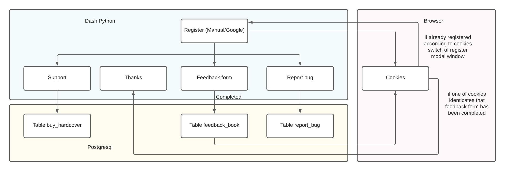
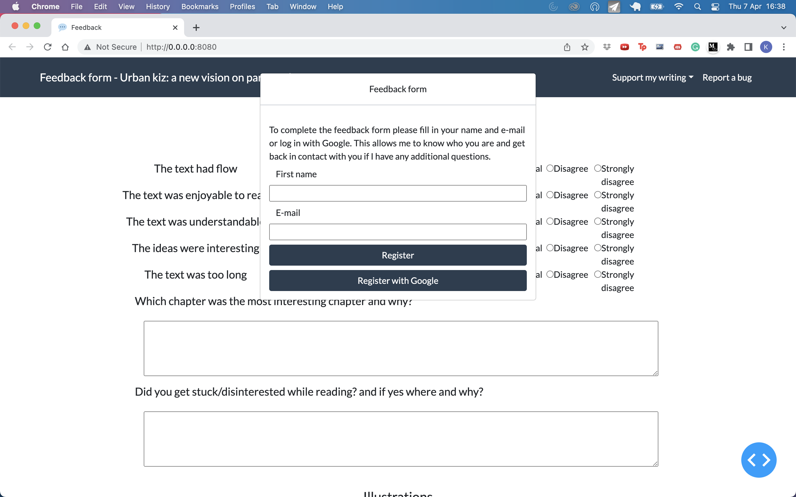

# BookFeedback

Book feedback form in Dash

Setup local postgressql for development:
https://www.youtube.com/watch?v=wTqosS71Dc4

Setup postgressql database on Heroku:
https://www.youtube.com/watch?v=w25ea_I89iM&t=1537s
https://gist.github.com/bradtraversy/0029d655269c8a972df726ed0ac56b88

Add local db SQL_URI in app.py secrets.json file. 

Set remote db SQL_URI as an environment variable in heroku:
https://devcenter.heroku.com/articles/config-vars

Create Google app & get app ID/secret from: https://cloud.google.com/console

Add google client id and client secret to secrets.json

Example secrets.json file:
{
  "app_id":"xxxxxxxxxxxxxxxx",
  "app_secret":"xxxxxxxxxxxxxxxx",
  "SQL_URI":"xxxxxxxxxxxxxxxx",
  "sender" : "xxxxxxxxxxxxxxxx@mailgun.org",
  "password":"xxxxxxxxxxxxxxxx",
  "website_URL":"https://xxx.herokuapp.com",
  "developer":"x@gmail.com",
  "smtp_login":"postmaster@sxxxxxxxxxxxxxxxx.mailgun.org"
}

## Overview interactions

## Screenshot 

## Screenshot 